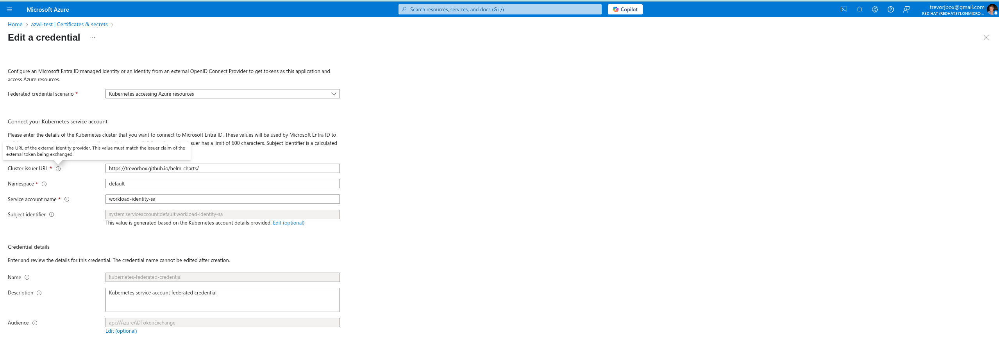
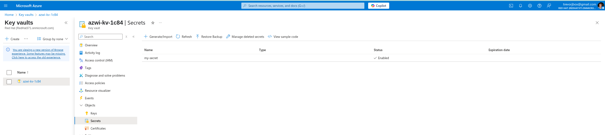

# Azure Federated Identity for Self-Managed Cluster

Testing <https://azure.github.io/azure-workload-identity/docs/installation/self-managed-clusters/oidc-issuer.html>...

## Default Kube API OIDC

Get the cluster's oidc information for service accounts...

```sh
tbox@fedora:~/git/trevorbox$ kubectl proxy -p 8999
error: listen tcp 127.0.0.1:8999: bind: address already in use
tbox@fedora:~/git/trevorbox$ curl http://127.0.0.1:8999/.well-known/openid-configuration
{"issuer":"https://kubernetes.default.svc","jwks_uri":"https://api.crc.testing:6443/openid/v1/jwks","response_types_supported":["id_token"],"subject_types_supported":["public"],"id_token_signing_alg_values_supported":["RS256"]}tbox@fedora:~/git/trevorbox$ curl http://127.0.0.1:8999/curl http://127.0.0.1:8999/.well-known/openid-configuration | jq > discovery.json^C
tbox@fedora:~/git/trevorbox$ curl http://127.0.0.1:8999/.well-known/openid-configuration | jq > discovery.json
  % Total    % Received % Xferd  Average Speed   Time    Time     Time  Current
                                 Dload  Upload   Total   Spent    Left  Speed
100   227  100   227    0     0  34917      0 --:--:-- --:--:-- --:--:-- 37833
tbox@fedora:~/git/trevorbox$ curl http://127.0.0.1:8999/openid/v1/jwks | jq > keys.json
```

keys.json

```json
{
  "keys": [
    {
      "use": "sig",
      "kty": "RSA",
      "kid": "8Jyn66tZ2Z7UIfzxuSuuAzb7lgVNiJr8SXSvKdeOqt0",
      "alg": "RS256",
      "n": "7w2daPMwUsxD34gE3PntA9pza1zGWCTrdTR4dhQC3X7EuZ-csNE0mvj-wGPGdxB5m__0Qv4xVdN2TXiWw_dhTDrCJZX1DviRUJUT52cNjJaYkZbAaIkegzxnjgQxj-wIwWYuOfqzo79JBrcl97kiPxxiPiX_da5apiFn7imDM8jT050THP-mMJMcgkWE9Iol62xWKZrpaHJEwjxrXyo2BaaDbwG6miEPkBnylOcqBqlMDXnvYja2YdBxZGfFyPIKPLH90joGLuAnd9iKda381gvxsy-JCMv9wng_UTt_99YhJ3hUOP_8xjHEa7GQ9D7gP9T1t8CmTxper8-4B0kmBQ",
      "e": "AQAB"
    },
    {
      "use": "sig",
      "kty": "RSA",
      "kid": "e3Qol5L3t3kqXcBbJC9lYSaJzUsrBM_qv163qeomjPY",
      "alg": "RS256",
      "n": "y_jZNmm4HN-ldSzU1ekKYm99I_AZh-QiFZ2RIG_GJcPyUepaYkBU9zVzRDJSX2E3eGHwzqtvmiefAslC0w86z-cXrX0v2Cw9meqddEGdSHc4zIkG4hSAxoWWQcYunsCdPExl7EOlPfsebQDp9_deDYdsQSo11nTD4SJHTVRkgMXsRd2Gp8GpMXCL1M9safrRAsYfQZJFSg3-fn8z17Mpml-gy72EpbKgwArN8Z7yei-8q5uTy5jXuG_xj-DsLPwcG3T86I2NhCf6kWekWQh41mdBZOmfzy-5-M7dBg0wfn2GecKsj2AzTU94pUwAqTeL_0DrHJzA8UP9QPVBE8foefZiBUmeFqBlwnqITvDt0moQez_4Zn3cXbu8p7inS7BhPsjJ8jrUoUw5tLqwNCoTDGll2hM7BdqdiND43T5XO8T9-VdbZDN0r_LrzH3CGbajUwXMnbQDPx4Kee1nWKx8Z5xUAimGKbrc1tK8SZbbU8YwNNkaM_GPbB124T42ej6KVVoCPj5_qr0Piwn947Rwp9XepW0oVrCUXm1ghzSjlUcAPJTKMZKKOVhrsLkc1WFesT4fLzYREE7cBasFoGTOTF0mTI7psasuHipJrokhhp_8hIlagmdUF8cMXJh7ho0X8lb9QjseYXEQrMR-df1E87jhuLMN6ANh-hVfb_C55IE",
      "e": "AQAB"
    },
    {
      "use": "sig",
      "kty": "RSA",
      "kid": "SWcUwLNtZMPJbkGwsaRbe1hs92Qp66n8emUuoz6rkWo",
      "alg": "RS256",
      "n": "4OV6CGNqOdXFN3IAjqIsPH4Gx5_B3U_8YQOFaBWVNu1YPSc-wsu7V7gCEhdpAbzkshd1wx5KOYxH1m1jZQyEE1Wr5ZcfoSzMsLIrUeuRUD11Irvhg_zRx50RklKR1_ql_qd1S0PAewPOghowj1jmof4RA7R8xu2FeK0x6YpJiCZKdZsGZtAck-Ap9M4VODkeDKXiz4aBm0jsnbt6rRMi0s1OUJp_ITR_DnvaA240DDztKy5S_w9bk1TbT2-4wdEyq1ddPrQNZYM2grqZo72uO92vydxxVf3YkAFJ_qdBbAYCkDi0d3L3ldfDdNWB4LjhiNq5sQHMrLqYNkM0XBz7BN1AH8C9V3Z6LWim6iZTjxuYFqaJT4oUjiMohCP-5gTiFXnA549vpCN3AteTKkk8RBsKj3rg3LNLlIvUyHts92AsvYyXNZ2F-7fs3SekUb_bl4sgwnGPBKEQsE2lkN9rSNdaXJolm8_ZbBi-6i1XnCFXtoCHqA4XFb53q5kltOxDtGD71gDoRbyCsgv3fbVOtgno_8hrMZ6gAZrh1GsZLEZBHDI5WQiDezfrSeQo0Ixnd5LoclRAQh9G6vjH4ukO6CXuiRbPr1-Tudb2tKh07xAEanUS_I_GUzV6rWsIJ_l46-qBjl9K2qQB1W0C-xufR7-AGF96NhceW5h52od6_z8",
      "e": "AQAB"
    }
  ]
}
```

default discovery.json

```json
{
  "issuer": "https://kubernetes.default.svc",
  "jwks_uri": "https://api.crc.testing:6443/openid/v1/jwks",
  "response_types_supported": [
    "id_token"
  ],
  "subject_types_supported": [
    "public"
  ],
  "id_token_signing_alg_values_supported": [
    "RS256"
  ]
}
```

Modify the discovery and host in github pages to make it publicly accessible...

[./.well-known/openid-configuration](./.well-known/openid-configuration)
[./openid/v1/jwks](./openid/v1/jwks)

publicly accessible urls...

<https://trevorbox.github.io/helm-charts/.well-known/openid-configuration>
<https://trevorbox.github.io/helm-charts/openid/v1/jwks>


Verify the tokens from service accounts...

<https://kubernetes.io/docs/concepts/storage/projected-volumes/#serviceaccounttoken>

```yaml
apiVersion: v1
kind: Pod
metadata:
  name: sa-token-test
spec:
  containers:
  - name: container-test
    image: busybox:1.28
    command: ["sleep", "3600"]
    volumeMounts:
    - name: token-vol
      mountPath: "/service-account"
      readOnly: true
  serviceAccountName: default
  volumes:
  - name: token-vol
    projected:
      sources:
      - serviceAccountToken:
          audience: "https://trevorbox.github.io/helm-charts/"
          expirationSeconds: 3600
          path: token
```

```json
{
  "aud": [
    "https://trevorbox.github.io/helm-charts/"
  ],
  "exp": 1751331243,
  "iat": 1751327643,
  "iss": "https://trevorbox.github.io/helm-charts/",
  "kubernetes.io": {
    "namespace": "default",
    "pod": {
      "name": "sa-token-test",
      "uid": "9d837dd1-92e9-451b-927f-91a7f91d6154"
    },
    "serviceaccount": {
      "name": "default",
      "uid": "9d86b02b-93fa-43d6-a02d-f583d0de9286"
    }
  },
  "nbf": 1751327643,
  "sub": "system:serviceaccount:default:default"
}
```


```yaml
apiVersion: v1
kind: Pod
metadata:
  name: sa-token-test2
spec:
  containers:
  - name: container-test
    image: busybox:1.28
    command: ["sleep", "3600"]
    volumeMounts:
    - name: token-vol
      mountPath: "/service-account"
      readOnly: true
  serviceAccountName: default
  volumes:
  - name: token-vol
    projected:
      sources:
      - serviceAccountToken:
          expirationSeconds: 3600
          path: token
```

```json
{
  "aud": [
    "https://trevorbox.github.io/helm-charts/",
    "https://kubernetes.default.svc"
  ],
  "exp": 1751331274,
  "iat": 1751327674,
  "iss": "https://trevorbox.github.io/helm-charts/",
  "kubernetes.io": {
    "namespace": "default",
    "pod": {
      "name": "sa-token-test2",
      "uid": "faffdca3-8c25-40e8-ac26-087d793b0876"
    },
    "serviceaccount": {
      "name": "default",
      "uid": "9d86b02b-93fa-43d6-a02d-f583d0de9286"
    }
  },
  "nbf": 1751327674,
  "sub": "system:serviceaccount:default:default"
}
```

Update spec.serviceAccountIssuer so that Azure can follow the well-known discovery OIDC locations from the issuer url...

```yaml
apiVersion: config.openshift.io/v1
kind: Authentication
metadata:
  annotations:
    include.release.openshift.io/ibm-cloud-managed: 'true'
    include.release.openshift.io/self-managed-high-availability: 'true'
    release.openshift.io/create-only: 'true'
  name: cluster
  ownerReferences:
    - apiVersion: config.openshift.io/v1
      kind: ClusterVersion
      name: version
      uid: 49b56123-3d3b-45aa-b476-4f8e862b0a18
  resourceVersion: '96651'
  uid: ab723866-9636-4cf8-9a12-e14dcacad36f
spec:
  oauthMetadata:
    name: ''
  serviceAccountIssuer: 'https://trevorbox.github.io/helm-charts/'
  type: ''
  webhookTokenAuthenticator:
    kubeConfig:
      name: webhook-authentication-integrated-oauth
status:
  integratedOAuthMetadata:
    name: oauth-openshift
```

## Setup Azure federated Identity Example






```sh
export AZURE_TENANT_ID="$(az account show -s 91be5643-3357-4cb7-b6c1-49fb2f53c126 --query tenantId -otsv)"
helm repo add azure-workload-identity https://azure.github.io/azure-workload-identity/charts
helm repo update
helm install workload-identity-webhook azure-workload-identity/workload-identity-webhook \
   --namespace azure-workload-identity-system \
   --create-namespace \
   --set azureTenantID="${AZURE_TENANT_ID}"

oc adm policy add-scc-to-user privileged -z azure-wi-webhook-admin -n azure-workload-identity-system

curl -sL https://github.com/Azure/azure-workload-identity/releases/download/v1.5.1/azure-wi-webhook.yaml | envsubst | kubectl apply -f -
# environment variables for the Azure Key Vault resource
export KEYVAULT_NAME="azwi-kv-$(openssl rand -hex 2)"
export KEYVAULT_SECRET_NAME="my-secret"
export RESOURCE_GROUP="azwi-quickstart-$(openssl rand -hex 2)"
export LOCATION="westus2"

# environment variables for the AAD application
# [OPTIONAL] Only set this if you're using a Azure AD Application as part of this tutorial
export APPLICATION_NAME="Red Hat"

# environment variables for the user-assigned managed identity
# [OPTIONAL] Only set this if you're using a user-assigned managed identity as part of this tutorial
export USER_ASSIGNED_IDENTITY_NAME="testwest"

# environment variables for the Kubernetes service account & federated identity credential
export SERVICE_ACCOUNT_NAMESPACE="default"
export SERVICE_ACCOUNT_NAME="workload-identity-sa"
export SERVICE_ACCOUNT_ISSUER="https://trevorbox.github.io/helm-charts/" # see section 1.1 on how to get the service account issuer url


az group create --name "${RESOURCE_GROUP}" --location "${LOCATION}"

az keyvault create --resource-group "${RESOURCE_GROUP}" \
   --location "${LOCATION}" \
   --name "${KEYVAULT_NAME}"

az provider register --namespace Microsoft.KeyVault

az keyvault secret set --vault-name "${KEYVAULT_NAME}" \
   --name "${KEYVAULT_SECRET_NAME}" \
   --value "Hello\!"

# create an AAD application if using Azure AD Application for this tutorial
az ad sp create-for-rbac --name "${APPLICATION_NAME}"

# create a user-assigned managed identity if using user-assigned managed identity for this tutorial
az identity create --name "${USER_ASSIGNED_IDENTITY_NAME}" --resource-group "${RESOURCE_GROUP}"

# if using user-assigned managed identity:
export USER_ASSIGNED_IDENTITY_CLIENT_ID="$(az identity show --name "${USER_ASSIGNED_IDENTITY_NAME}" --resource-group "${RESOURCE_GROUP}" --query 'clientId' -otsv)"
export USER_ASSIGNED_IDENTITY_OBJECT_ID="$(az identity show --name "${USER_ASSIGNED_IDENTITY_NAME}" --resource-group "${RESOURCE_GROUP}" --query 'principalId' -otsv)"
az keyvault set-policy --name "${KEYVAULT_NAME}" \
  --secret-permissions get \
  --object-id "${USER_ASSIGNED_IDENTITY_OBJECT_ID}"

azwi serviceaccount create phase sa \
  --aad-application-name "${APPLICATION_NAME}" \
  --service-account-namespace "${SERVICE_ACCOUNT_NAMESPACE}" \
  --service-account-name "${SERVICE_ACCOUNT_NAME}"

cat <<EOF | kubectl apply -f -
apiVersion: v1
kind: ServiceAccount
metadata:
  annotations:
    azure.workload.identity/client-id: ${APPLICATION_CLIENT_ID:-$USER_ASSIGNED_IDENTITY_CLIENT_ID}
  name: ${SERVICE_ACCOUNT_NAME}
  namespace: ${SERVICE_ACCOUNT_NAMESPACE}
EOF

azwi serviceaccount create phase federated-identity \
  --aad-application-name "${APPLICATION_NAME}" \
  --service-account-namespace "${SERVICE_ACCOUNT_NAMESPACE}" \
  --service-account-name "${SERVICE_ACCOUNT_NAME}" \
  --service-account-issuer-url "${SERVICE_ACCOUNT_ISSUER}"

# Get the object ID of the AAD application
export APPLICATION_OBJECT_ID="$(az ad app show --id ${APPLICATION_CLIENT_ID} --query id -otsv)"

az identity federated-credential create \
  --name "kubernetes-federated-credential" \
  --identity-name "${USER_ASSIGNED_IDENTITY_NAME}" \
  --resource-group "${RESOURCE_GROUP}" \
  --issuer "${SERVICE_ACCOUNT_ISSUER}" \
  --audience "${SERVICE_ACCOUNT_ISSUER}" \
  --subject "system:serviceaccount:${SERVICE_ACCOUNT_NAMESPACE}:${SERVICE_ACCOUNT_NAME}"

export KEYVAULT_URL="$(az keyvault show -g ${RESOURCE_GROUP} -n ${KEYVAULT_NAME} --query properties.vaultUri -o tsv)"
cat <<EOF | kubectl apply -f -
apiVersion: v1
kind: Pod
metadata:
  name: quick-start
  namespace: ${SERVICE_ACCOUNT_NAMESPACE}
  labels:
    azure.workload.identity/use: "true"
spec:
  serviceAccountName: ${SERVICE_ACCOUNT_NAME}
  containers:
    - image: ghcr.io/azure/azure-workload-identity/msal-go # docker.io/library/busybox:1.28 
      name: oidc
      # command: ["sleep", "3600"]
      env:
      - name: KEYVAULT_URL
        value: ${KEYVAULT_URL}
      - name: SECRET_NAME
        value: ${KEYVAULT_SECRET_NAME}
  nodeSelector:
    kubernetes.io/os: linux
EOF

```

The pod should be able to access the KeyVault, as evident in the logs of the pod.

## Testing OIDC

If you change the issuer in...

```yaml
apiVersion: config.openshift.io/v1
kind: Authentication
metadata:
  name: cluster
spec:
  oauthMetadata:
    name: ''
  serviceAccountIssuer: 'https://trevorbox.github.io/terrible/'
  type: ''
  webhookTokenAuthenticator:
    kubeConfig:
      name: webhook-authentication-integrated-oauth
status:
  integratedOAuthMetadata:
    name: oauth-openshift
```

set the jwks-uri override in...

```yaml
apiVersion: operator.openshift.io/v1
kind: KubeAPIServer
metadata:
 name: cluster
spec:
  unsupportedConfigOverrides:
    apiServerArguments:
      service-account-jwks-uri:
        - 'https://example.com/whatever'
```

You get the expected result... 
```sh
E0701 23:32:51.310663       1 main.go:60] "failed to get secret from keyvault" err=<
	FromAssertion(): http call(https://login.microsoftonline.com/0fbc2b12-aa64-4908-8476-edefe66b2877/oauth2/v2.0/token)(POST) error: reply status code was 401:
	{"error":"invalid_client","error_description":"AADSTS700211: No matching federated identity record found for presented assertion issuer 'https://trevorbox.github.io/terrible/'. Please check your federated identity credential Subject, Audience and Issuer against the presented assertion. https://learn.microsoft.com/entra/workload-id/workload-identity-federation Trace ID: fc970b68-0efa-4ed4-81b6-3ebf53a91c00 Correlation ID: de80f394-3b7e-4ede-bcc6-4bb0453cf78f Timestamp: 2025-07-01 23:32:51Z","error_codes":[700211],"timestamp":"2025-07-01 23:32:51Z","trace_id":"fc970b68-0efa-4ed4-81b6-3ebf53a91c00","correlation_id":"de80f394-3b7e-4ede-bcc6-4bb0453cf78f","error_uri":"https://login.microsoftonline.com/error?code=700211"}
 > keyvault="https://azwi-kv-1c84.vault.azure.net/" secretName="my-secret"
```

If you have a bad jwks public key (https://trevorbox.github.io/helm-charts/openid/v1/jwks)...

```sh
E0702 14:15:22.337767       1 main.go:60] "failed to get secret from keyvault" err=<
	FromAssertion(): http call(https://login.microsoftonline.com/0fbc2b12-aa64-4908-8476-edefe66b2877/oauth2/v2.0/token)(POST) error: reply status code was 400:
	{"error":"invalid_request","error_description":"AADSTS900612: Failed to parse provider signing keys. Trace ID: 79f453a3-320c-4c64-b065-baff625da801 Correlation ID: 9fc2dcd9-6efb-4730-9438-76efc1973b97 Timestamp: 2025-07-02 14:15:22Z","error_codes":[900612],"timestamp":"2025-07-02 14:15:22Z","trace_id":"79f453a3-320c-4c64-b065-baff625da801","correlation_id":"9fc2dcd9-6efb-4730-9438-76efc1973b97"}
 > keyvault="https://azwi-kv-1c84.vault.azure.net/" secretName="my-secret"
```
